# Class Diagram

Full class diagram of the ShopEase backend. Every class, its responsibilities, and how they relate to each other.

```mermaid
classDiagram
    %% ─── Abstract Base Classes ───────────────────────────────────────────
    class BaseDAO {
        <<abstract>>
        #_db : Session
        +find_by_id(id: int) dict*
        +insert(data: dict) dict*
        +update(id: int, data: dict) dict*
        +delete(id: int) bool*
        +find_all() list~dict~*
    }

    class BaseRepository {
        <<abstract>>
        +get_by_id(id: int) object*
        +save(entity: object) object*
        +delete(id: int) None*
        +get_all() list*
    }

    class CacheService {
        <<abstract>>
        +get(key: str) object*
        +set(key: str, value: object, ttl: int) None*
        +delete(key: str) None*
        +clear() None*
    }

    class PaymentProvider {
        <<abstract>>
        +process(amount: float) bool*
    }

    class OrderObserver {
        <<abstract>>
        +on_order_placed(order: Order) None*
    }

    %% ─── Domain Objects ──────────────────────────────────────────────────
    class User {
        <<dataclass>>
        +email : str
        +password : str
        +name : str
        +id : int | None = None
        +is_admin : bool = False
    }

    class Product {
        <<dataclass>>
        +name : str
        +price : float
        +stock : int
        +category : str
        +image_url : str | None
        +description : str | None
        +id : int | None = None
    }

    class Order {
        <<dataclass>>
        +user_id : int
        +payment_method : str
        +total : float
        +status : str = pending
        +id : int | None = None
    }

    class OrderItem {
        <<dataclass>>
        +order_id : int
        +product_id : int
        +quantity : int
        +unit_price : float
        +id : int | None = None
    }

    class CartItem {
        <<dataclass>>
        +cart_id : int
        +product_id : int
        +quantity : int
        +id : int | None = None
    }

    %% ─── DAO Implementations ─────────────────────────────────────────────
    class UserDAO {
        +find_by_email(email: str) dict
    }

    class ProductDAO {
        +find_by_category(category: str) list~dict~
        +search(query: str) list~dict~
    }

    class OrderDAO {
        +find_by_user_id(user_id: int) list~dict~
    }

    class CartItemDAO {
        +find_by_cart_id(cart_id: int) list~dict~
        +find_by_cart_and_product(cart_id, product_id) dict
        +delete_by_cart_id(cart_id: int) None
    }

    class OrderItemDAO {
        +find_by_order_id(order_id: int) list~dict~
    }

    %% ─── Repository Implementations ──────────────────────────────────────
    class UserRepository {
        -_dao : UserDAO
        +get_by_email(email: str) User
    }

    class ProductRepository {
        -_dao : ProductDAO
        +search(query: str, category: str) list~Product~
    }

    class OrderRepository {
        -_order_dao : OrderDAO
        -_cart_dao : CartItemDAO
        -_order_item_dao : OrderItemDAO
        +get_by_user_id(user_id: int) list~Order~
        +save_order_item(item: OrderItem) OrderItem
        +save_cart_item(item: CartItem) CartItem
        +get_order_items(order_id: int) list~OrderItem~
        +update_status(id: int, status: str) Order
    }

    %% ─── Cache Implementation ────────────────────────────────────────────
    class InMemoryCache {
        -_store : dict
        -_lock : RLock
        +get(key: str) object
        +set(key: str, value: object, ttl: int) None
        +delete(key: str) None
        +clear() None
    }

    %% ─── Services ────────────────────────────────────────────────────────
    class UserService {
        -_repo : UserRepository
        +register(email, password, name) User
        +get_by_id(id: int) User
        +get_all() list~User~
    }

    class AuthService {
        -_repo : UserRepository
        +login(email, password) str
        +get_current_user(token: str) User
    }

    class ProductService {
        -_repo : ProductRepository
        -_cache : CacheService
        +get_by_id(id: int) Product
        +get_all(search, category) list~Product~
        +create(name, price, stock, category) Product
        +update(id: int, **kwargs) Product
        +delete(id: int) None
    }

    class CartService {
        -_order_repo : OrderRepository
        -_product_service : ProductService
        -_lock : RLock
        +get_cart(user_id: int) list~CartItem~
        +add_to_cart(user_id, product_id, quantity) CartItem
        +remove_from_cart(user_id, product_id) None
        +clear_cart(user_id: int) None
    }

    class OrderService {
        -_order_repo : OrderRepository
        -_product_service : ProductService
        -_cart_service : CartService
        -_payment_factory : PaymentFactory
        -_observers : list~OrderObserver~
        -_lock : RLock
        +place_order(user_id, payment_method) Order
        +get_order(order_id, user_id) Order
        +get_orders(user_id: int) list~Order~
        +register_observer(observer) None
    }

    class PaymentFactory {
        -_providers : dict
        +create(method: str) PaymentProvider
        +get_available_payment_methods() list~str~
    }

    %% ─── Payment & Observer Implementations ──────────────────────────────
    class CreditCardPayment {
        -_max_amount : float
        +process(amount: float) bool
    }

    class PayPalPayment {
        -_max_amount : float
        +process(amount: float) bool
    }

    class EmailNotifier {
        +on_order_placed(order: Order) None
    }

    class InventoryUpdater {
        -_order_repo : OrderRepository
        -_product_service : ProductService
        +on_order_placed(order: Order) None
    }

    %% ─── Inheritance ─────────────────────────────────────────────────────
    BaseDAO <|-- UserDAO : extends
    BaseDAO <|-- ProductDAO : extends
    BaseDAO <|-- OrderDAO : extends
    BaseDAO <|-- CartItemDAO : extends
    BaseDAO <|-- OrderItemDAO : extends

    BaseRepository <|-- UserRepository : implements
    BaseRepository <|-- ProductRepository : implements
    BaseRepository <|-- OrderRepository : implements

    CacheService <|-- InMemoryCache : implements
    PaymentProvider <|-- CreditCardPayment : implements
    PaymentProvider <|-- PayPalPayment : implements
    OrderObserver <|-- EmailNotifier : implements
    OrderObserver <|-- InventoryUpdater : implements

    %% ─── Composition & Dependencies ──────────────────────────────────────
    UserRepository o-- UserDAO : uses
    ProductRepository o-- ProductDAO : uses
    OrderRepository o-- OrderDAO : uses
    OrderRepository o-- CartItemDAO : uses
    OrderRepository o-- OrderItemDAO : uses

    ProductService o-- ProductRepository : uses
    ProductService o-- CacheService : uses (Strategy)
    UserService o-- UserRepository : uses
    AuthService o-- UserRepository : uses
    CartService o-- OrderRepository : uses
    CartService o-- ProductService : uses

    OrderService o-- OrderRepository : uses
    OrderService o-- ProductService : uses
    OrderService o-- CartService : uses
    OrderService o-- PaymentFactory : uses
    OrderService o-- OrderObserver : notifies (0..*)

    PaymentFactory ..> PaymentProvider : creates (Factory Method)
    InventoryUpdater o-- OrderRepository : uses
    InventoryUpdater o-- ProductService : uses
```

---

## Abstract Base Classes

### BaseDAO

The root of the data access hierarchy. Every DAO extends this class and receives a SQLAlchemy `Session` via constructor injection. It enforces a strict interface: `find_by_id`, `insert`, `update`, `delete`, `find_all`. No business logic lives here — only raw SQL execution returning plain `dict` rows.

All five concrete DAOs (`UserDAO`, `ProductDAO`, `OrderDAO`, `CartItemDAO`, `OrderItemDAO`) inherit from it and add table-specific queries on top.

### BaseRepository

Sits one layer above DAOs. Concrete repositories receive a DAO in their constructor, call its methods to get raw dicts, and convert them to domain objects. The service layer only ever talks to repositories — it never sees dicts or SQL.

### CacheService

Defines the cache contract: `get`, `set`, `delete`, `clear`. `ProductService` depends on this abstraction, not the concrete implementation. Swapping `InMemoryCache` for a Redis-backed implementation requires zero changes to `ProductService`.

### PaymentProvider

Defines a single method: `process(amount)`. `CreditCardPayment` and `PayPalPayment` implement it differently. `PaymentFactory` creates the correct subclass at runtime — the caller never instantiates a provider directly.

### OrderObserver

The observer interface. `OrderService` holds a list of registered observers and calls `on_order_placed(order)` after every successful order. Currently two implementations: `EmailNotifier` (logs confirmation) and `InventoryUpdater` (decrements stock).

---

## Domain Objects

Pure Python `@dataclass` objects. They carry no database, framework, or network coupling. Repositories create them from DAO dicts; services pass them across layer boundaries.

| Class | Purpose |
|---|---|
| `User` | Registered user — email, bcrypt password, admin flag |
| `Product` | Catalogue item — name, price, stock, category, image, description |
| `Order` | Placed order — user reference, payment method, total, status |
| `OrderItem` | Line item — unit price snapshot at purchase time, not the current product price |
| `CartItem` | Temporary cart entry — cleared after order placement |

`OrderItem.unit_price` is intentionally a snapshot. If the product price changes later, historical order totals remain accurate.

---

## DAO Layer

Each DAO handles exactly one table. Methods execute raw SQL via SQLAlchemy Core and return plain `dict` rows. The `insert` method captures `result.lastrowid` before calling `commit()` to avoid the connection-pool race condition where `last_insert_rowid()` returns 0 on a different connection.

---

## Repository Layer

Repositories translate between raw dicts (from DAOs) and typed domain objects. `OrderRepository` is the most complex — it wraps three DAOs (`OrderDAO`, `CartItemDAO`, `OrderItemDAO`) because order operations span multiple tables.

---

## Service Layer

Business logic lives exclusively in services. All service attributes are private (`_`-prefixed). External callers only use public methods.

| Service | Responsibility |
|---|---|
| `UserService` | Registration, user lookup |
| `AuthService` | JWT login, token validation |
| `ProductService` | Product CRUD + cache management |
| `CartService` | Cart operations with RLock for thread safety |
| `OrderService` | Order placement, payment, observer notification, RLock |
| `PaymentFactory` | Creates payment providers by method key |

### Cache Strategy in ProductService

`ProductService` checks `InMemoryCache` before hitting the repository. Cache keys follow the pattern `product:{id}` and `products:all`. Every write operation (`create`, `update`, `delete`) invalidates affected keys immediately.

### Thread Safety

`CartService` and `OrderService` both use `threading.RLock` to prevent race conditions under concurrent requests — for example, two users adding the last unit of a product simultaneously.

---

## Design Patterns

| Pattern | Where |
|---|---|
| **Factory Method** | `PaymentFactory.create(method)` returns the correct `PaymentProvider` subclass |
| **Observer** | `OrderService` notifies all registered `OrderObserver` instances after order placement |
| **Strategy** | `CacheService` ABC allows swapping cache backends without touching `ProductService` |
| **Dependency Injection** | Constructor injection throughout; FastAPI `Depends()` wires the full chain |
| **Repository** | Repositories isolate domain logic from raw SQL, making services DB-agnostic |
