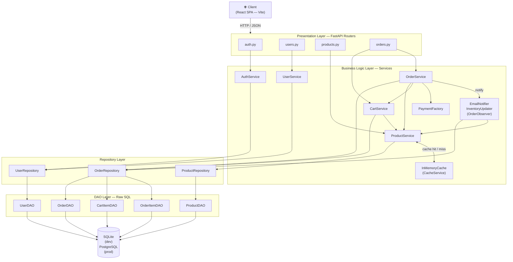

# High Level Design

ShopEase is structured as a strict five-layer system. Every request enters at the top, flows down through each layer in order, and returns back up. No layer is ever skipped.

---

## Layers

### Presentation Layer — FastAPI Routers

The only entry point for HTTP traffic. Routers validate requests with Pydantic schemas, delegate all business logic to services via `Depends()`, and serialize domain objects back to JSON response schemas. No business logic, no SQL — only HTTP in and HTTP out.

Four router modules map to four resource domains:

| Router | Responsibility |
|---|---|
| `auth.py` | Register and login — returns a JWT |
| `users.py` | `/me` endpoint — returns the current user's profile |
| `products.py` | Product catalogue CRUD — admin write, public read |
| `orders.py` | Cart management, order placement, order history, payment methods |

### Business Logic Layer — Services

All business rules live here. Services receive domain objects from repositories, apply rules, and return domain objects. They never see raw SQL or plain dicts.

| Service | Responsibility |
|---|---|
| `AuthService` | JWT creation and validation, bcrypt password verification |
| `UserService` | Registration with duplicate-email guard, user lookup |
| `ProductService` | Product CRUD with integrated `InMemoryCache` (TTL 300 s) |
| `CartService` | Cart read/write with `RLock` for concurrent request safety |
| `OrderService` | Order placement: validates cart, processes payment, persists, notifies observers |
| `PaymentFactory` | Factory Method — returns the correct `PaymentProvider` subclass |
| `EmailNotifier` | Observer — logs order confirmation |
| `InventoryUpdater` | Observer — decrements stock after each successful order |

`InMemoryCache` sits alongside services and is injected into `ProductService` as a `CacheService` strategy. `ProductService` checks the cache before hitting the repository on every read and invalidates affected keys on every write.

`OrderService` uses the Observer pattern: after a successful order it calls `on_order_placed(order)` on every registered `OrderObserver`. Currently two observers are registered: `EmailNotifier` and `InventoryUpdater`.

`CartService` and `OrderService` both hold a `threading.RLock` to prevent race conditions when concurrent requests touch the same cart or inventory.

### Repository Layer

Repositories are the translation boundary between raw database rows and typed domain objects. They call DAOs to get `dict` rows and convert them into `@dataclass` instances before returning them to services.

| Repository | DAOs used |
|---|---|
| `UserRepository` | `UserDAO` |
| `ProductRepository` | `ProductDAO` |
| `OrderRepository` | `OrderDAO`, `CartItemDAO`, `OrderItemDAO` |

`OrderRepository` wraps three DAOs because order operations span three tables. Services never know this — they see a single repository interface.

### DAO Layer — Raw SQL

Each DAO handles exactly one table. Methods execute raw SQL via SQLAlchemy Core and return plain `dict` rows. No business logic, no domain objects.

`insert()` captures `result.lastrowid` before calling `commit()` to avoid the connection-pool race condition where `last_insert_rowid()` returns `0` on a different connection.

### Database

SQLite in development (file-based, zero config). PostgreSQL in production (set `DATABASE_URL` in `.env`). Alembic manages migrations for both. SQLAlchemy Core handles connection pooling and session lifecycle.

---

## Cross-Cutting Concerns

### Authentication

Every protected route depends on `get_current_user`, which extracts the Bearer JWT from the `Authorization` header, validates it with `AuthService`, and returns the `User` domain object. Routes that require admin access additionally depend on `get_current_admin`.

### Dependency Injection

`core/dependencies.py` wires the full chain: DAO → Repository → Service → Router. FastAPI `Depends()` resolves the graph per request. The `InMemoryCache` and `PaymentFactory` are application-wide singletons.

### Thread Safety

`InMemoryCache`, `CartService`, and `OrderService` all use `threading.RLock`. This prevents overselling (two users buying the last unit simultaneously) and cache corruption under concurrent writes.

### Error Propagation

Services raise `ValueError` for business rule violations. Routers catch `ValueError` and translate it to the appropriate HTTP status code (400 for bad requests, 404 for not found).
