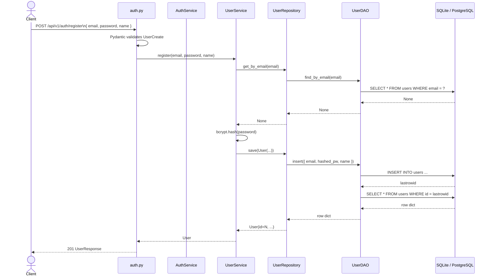
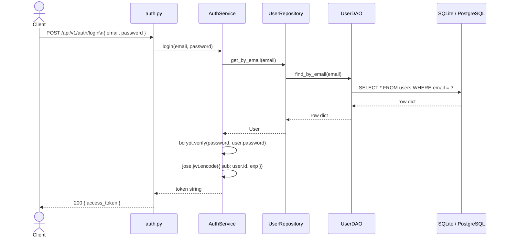
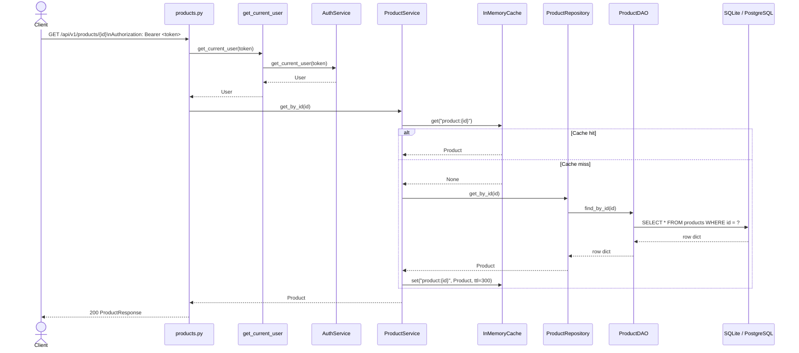
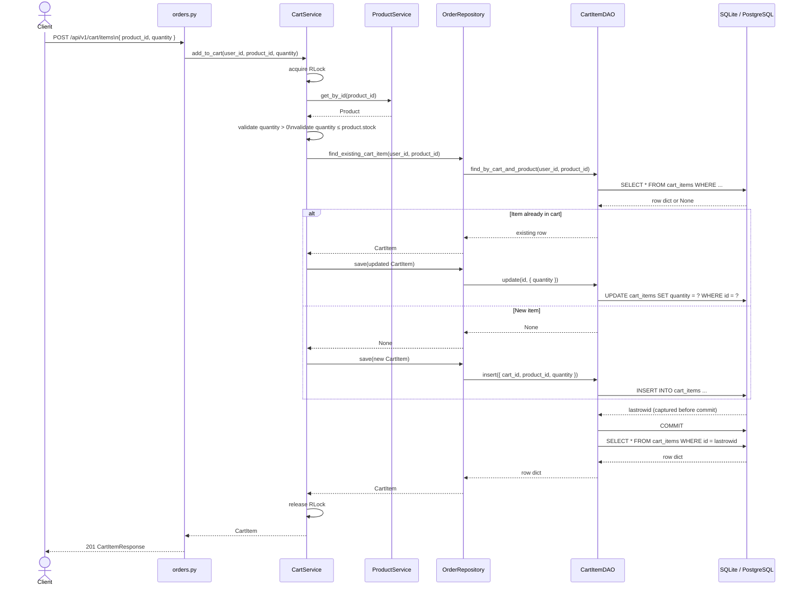
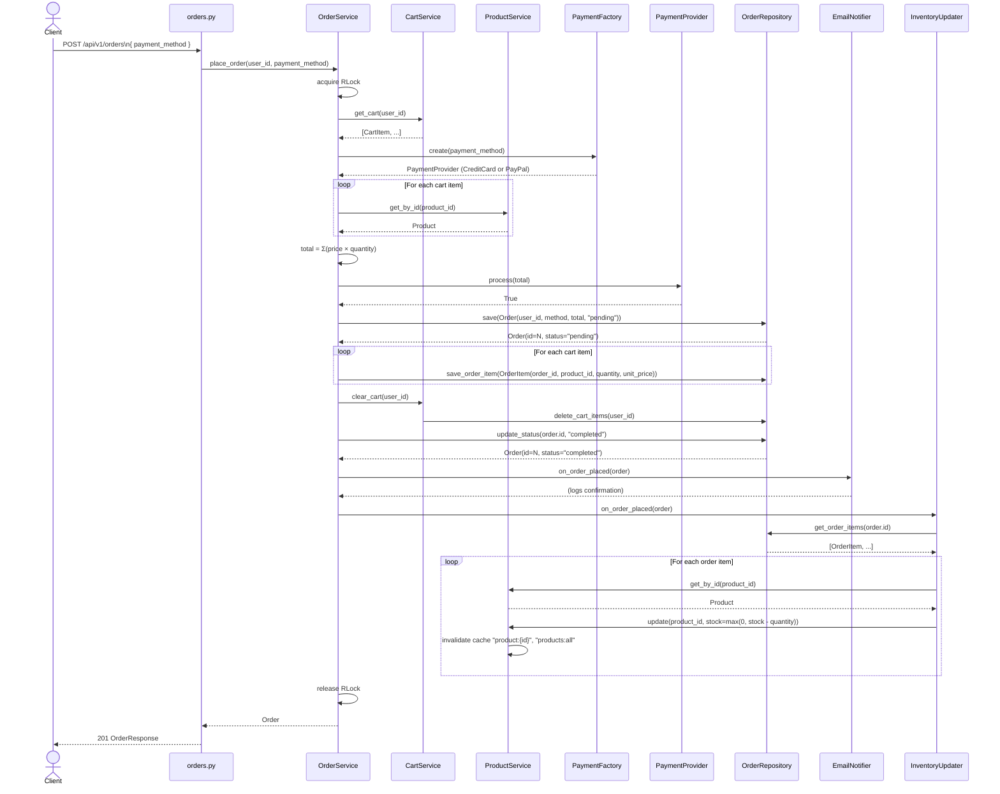
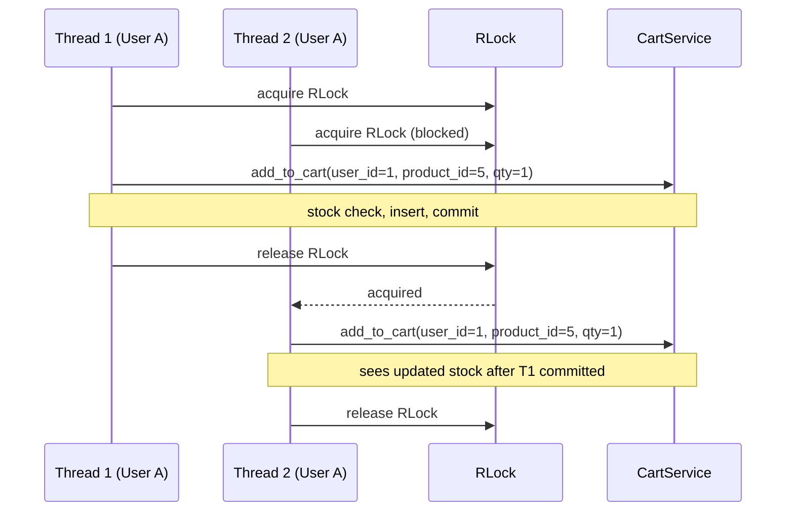
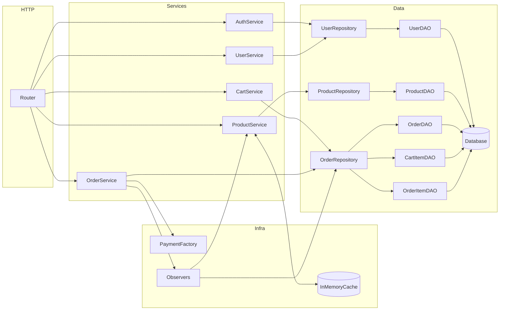

# Low Level Design

End-to-end execution traces for every major operation. Each diagram follows a single request from the HTTP boundary down to the database and back.

---

## 1. User Registration

---

## 2. Login and JWT Issuance

---

## 3. Product Read with Cache

---

## 4. Add to Cart

---

## 5. Order Placement

---

## 6. Thread Safety — Concurrent Cart Access

The `RLock` in `CartService` ensures that concurrent requests for the same user are serialized. The same pattern applies in `OrderService` for concurrent order placement.

---

## Component Interactions Summary

